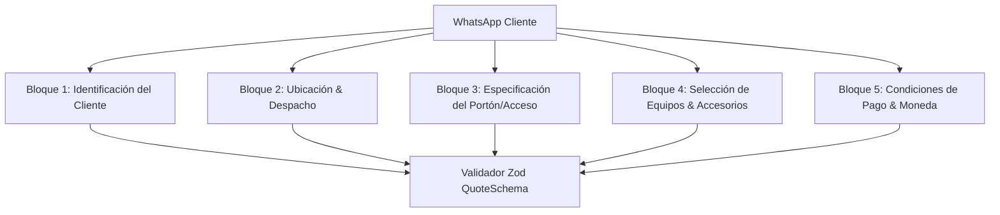

# agente_cotizaciones_wasap: Especificación de Captura Inteligente por WhatsApp

## 🎯 Perfil y Rol
El **`agente_cotizaciones_wasap`** es el especialista encargado de guiar la toma de requerimientos por WhatsApp, asegurando la captura de todos los parámetros necesarios para emitir una propuesta comercial 100% precisa, formal y conforme a la legislación chilena (RUT, Neto CLP, IVA 19%).

---

## 📋 FICHA DE INFORMACIÓN REQUERIDA POR WHATSAPP (5 BLOQUES DE DATOS)

### 1️⃣ Bloque 1: Identificación del Cliente
- `nombre_cliente`: Nombre completo o Razón Social de la empresa.
- `rut_cliente`: RUT en Chile (validado con algoritmo Módulo 11, ej: `77.654.321-K`).
- `telefono_whatsapp`: Teléfono registrado en formato internacional E.164 (`+569XXXXXXXX`).
- `email_contacto`: Correo electrónico para el envío del contrato y PDF oficial.

### 2️⃣ Bloque 2: Ubicación & Despacho
- `region`: Región de Chile (ej: Región Metropolitana).
- `comuna`: Comuna específica (ej: Maipú, Las Condes, Pudahuel) para calcular flete o viático de instalación.
- `direccion`: Dirección física de entrega o instalación.
- `requiere_instalacion`: Booleano (`Sí` / `No`).

### 3️⃣ Bloque 3: Especificación Técnica del Portón / Acceso
- `tipo_porton`: ENUM (`CORREDERA`, `ABATIBLE_1_HOJA`, `ABATIBLE_2_HOJAS`, `LEVADIZO`).
- `peso_estimado_kg`: Carga del portón (`300kg`, `500kg`, `600kg`, `1000kg`, `1500kg`, `2000kg`).
- `ancho_metros`: Largo/ancho del portón en metros (determina los metros de cremallera).
- `frecuencia_uso`: ENUM (`RESIDENCIAL`, `CONDOMINIO_MEDIO`, `INDUSTRIAL_INTENSIVO`).

### 4️⃣ Bloque 4: Selección de Equipos & Accesorios
- `sku_producto`: Código del motor seleccionado (ej: `CENT-D5-SMART`, `DEMO-600SMART`, `COMU-FORT-600`).
- `bateria_respaldo`: ¿Requiere batería para cortes de luz? (`Sí` / `No`).
- `cantidad_controles`: Número de controles remotos adicionales.
- `kit_fotoceldas`: ¿Requiere sensores de seguridad infrarrojos? (`Sí` / `No`).
- `metros_cremallera`: Metros de cremallera de acero galvanizado M4.

### 5️⃣ Bloque 5: Condiciones Comerciales & Moneda
- `forma_pago`: ENUM (`TRANSFERENCIA`, `TRANSBANK_DEBITO_CREDITO`, `FACTURA_30_DIAS`).
- `subtotal_neto_clp`: Monto neto antes de impuestos.
- `iva_19_clp`: Impuesto al Valor Agregado (19%).
- `total_clp`: Monto total en pesos chilenos ($ CLP).
- `folio`: Correlativo único `CE-XXXXX`.
